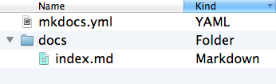
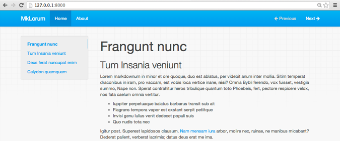
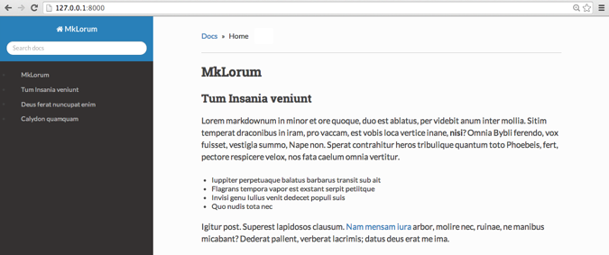

# MkDocs

Markdown 项目文档工具. 本文档翻译自官网[mkdocs][mkdocs]. 本文档托管于 [Github][github].

---

## 概述

MkDocs 是一个用于创建项目文档的 **快速**, **简单** , **完美华丽** 的静态站点生成器. 文档源码使用 Markdown 来撰写, 用一个 YAML 文件作为配置文档.

---

**MkDocs 仍处于开发阶段.**

我们正在快速成长, 但是文档仍然需要完善, 软件本身也有一些不完善的地方. 1.0 版本计划在未来几周内发布.

---

#### 任意托管.

构建完全的静态 HTML 站点 , 可以将它托管到 GitHub pages, Amazon S3 等任意地方.

#### 大量主题.

默认包含大量美观的主题. 可以从 bootstrap, readthedocs 和 12 款 bootswatch 主题中选择.

#### 即时预览.

内建的开发服务器使你在撰写文档的时候就即时预览. 它甚至能在保存更改时自动载入, 只需刷新浏览器就可以查看更改.

#### 易于配置.

可以配置文档主题.

#### 交叉索引.

使用 MkDocs 链接语法创建交叉索引.

---

## 安装

需要 [Python][python] 和 Python package manager [pip][pip] 来安装 MkDocs . 可以通过以下命令查看是否安装了上述依赖:

    $ python --version
    Python 2.7.2
    $ pip --version
    pip 1.5.2

MkDocs 支持 Python 2.6, 2.7, 3.3 和 3.4.

使用 pip 安装 `mkdocs` :

    $ pip install mkdocs

`mkdocs`已经安装到你的系统. 运行 `mkdocs help` 以检查是否正确安装.

    $ mkdocs help
    mkdocs [help|new|build|serve|gh-deploy] {options}

---

## 开始

输入以下命令以开始一个新项目.

    $ mkdocs new my-project
    $ cd my-project

我们看一下已经创建的初始化项目.

有一个配置文件 `mkdocs.yml`, 和一个包含文档源码的 `docs` 文件夹. 在 `docs` 文件夹里包含了一个名为 `index.md` 的文档.

MkDocs 包含了一个内建的服务器以预览当前文档. 控制台切换当前目录到 `mkdocs.yml` 配置文件相同文件夹, 输入 `mkdocs serve` 命令以启动内建服务器:

    $ mkdocs serve
	Running at: http://127.0.0.1:8000/

在浏览器中打开 [http://127.0.0.1:8000/](http://127.0.0.1:8000/) , 你将看到以下页面:

内建服务器支持在配置文件,文档目录或主题发生改变时自动载入并重新生成文档.

编辑 `docs/index.md` 文件并保存. 刷新浏览器你将看到文档被同步更新.

现在可以开始编辑配置文件 `mkdocs.yml` 了.  把 `site_name` 改成其他内容并保存文档.

刷新浏览器你将看到网页标题已发生改变.

## 添加页面

编辑 `doc/index.md` 文档, 将默认标题改为 `MkLorum`, 刷新浏览器即可看到标题变化.

现在为文档添加第二个页面:

    $ curl 'jaspervdj.be/lorem-markdownum/markdown.txt' > docs/about.md

要为文档添加导航条, 只需在配置文件中添加导航条需要的标题和排序即可:

    site_name: MkLorum
    pages:
    - [index.md, Home]
    - [about.md, About]

刷新浏览器即可看到 `Home` 和 `About` 导航栏目.

## 配置主题

可以在配置文件中修改文档主题. 在 `mkdocs.yml` 中添加如下内容:

    site_name: MkLorum
    pages:
    - [index.md, Home]
    - [about.md, About]
    theme: readthedocs

刷新浏览器即可看到 ReadTheDocs 主题已被应用.

## 站点生成

我们现在已经可以发布 `MkLorum` 文档了. 通过以下命令生成文档.

    $ mkdocs build

该命令创建了一个 `site` 新目录. 可以通过以下命令浏览该目录内容:

    $ ls site
    about css fonts img index.html js

注意源码被分别输出为 `index.html` 和 `about/index.html`.  主题中的其他文件也被复制到了 `site` 目录中.

如果你使用 `git` 等版本控制系统, 你可能不希望提交构建之后的文档到版本库.  在 `.gitignore` 中添加 `site/` 即可忽略该目录.

    $ echo "site/" >> .gitignore

如果你使用其他版本控制系统则需要查阅相关文档以确定如何忽略指定目录.

一段时间后, 可能有文件被从源码中移除了, 但是相关的文档仍残留在 `site` 目录中. 在构建命令中添加 `--clean` 参数即可移除这些文档.

    $ mkdocs build --clean

## 发布

MkDocs 生成的文档只包含静态文件, 因此你可以将文档部署到任意地方. [GitHub project pages](https://help.github.com/articles/creating-project-pages-manually) 和 [Amazon S3](http://docs.aws.amazon.com/AmazonS3/latest/dev/WebsiteHosting.html) 是不错的选择. 只需上传 `site` 目录到你需要发布的位置即可.

[python]: https://www.python.org/
[pip]: http://pip.readthedocs.org/en/latest/installing.html
[mkdocs]: http://www.mkdocs.org/
[github]: https://github.com/chengsu/markdown-docs-zh/
